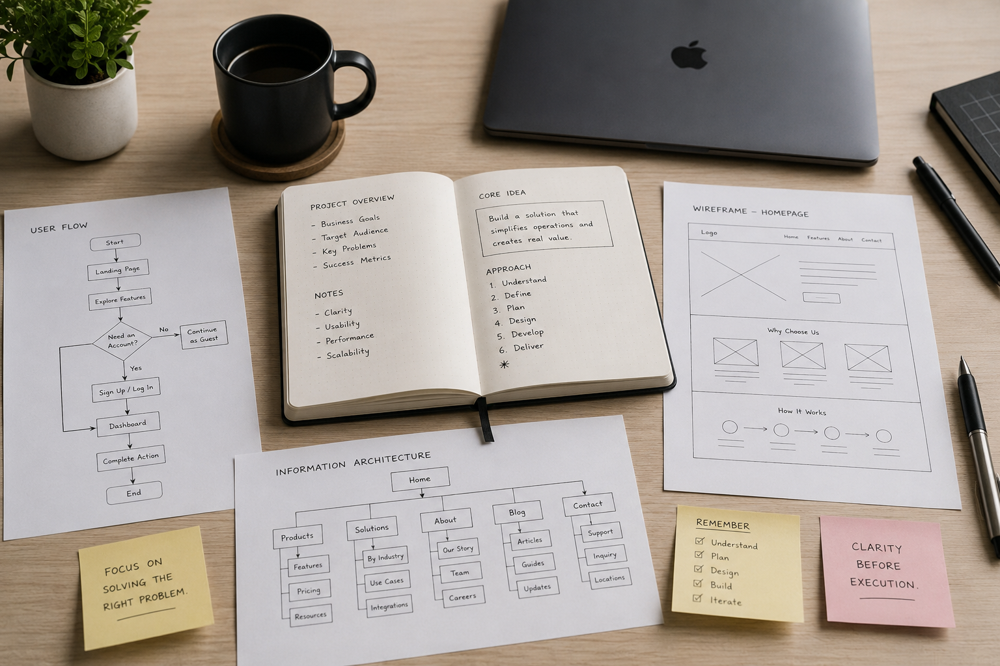
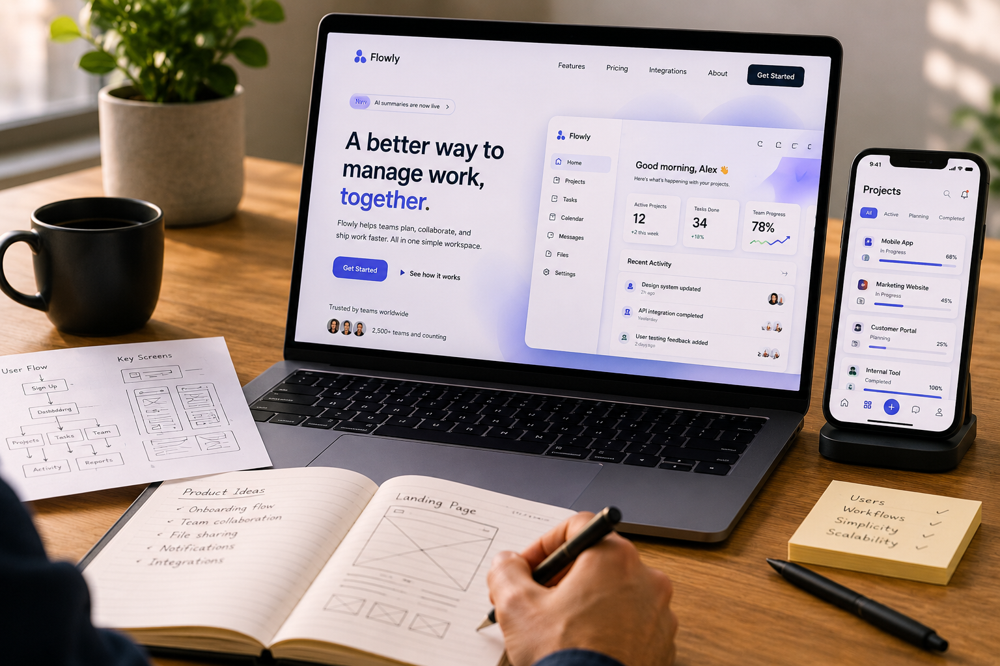
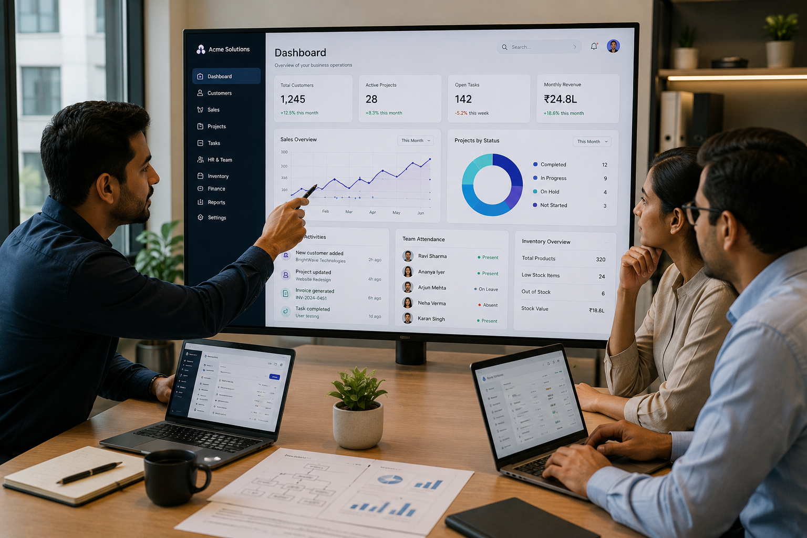

<!-- markdownlint-disable MD024 -->
# Website Content - mohantyabhisek.com

## Home Page

### Hero Section

**Heading**
Custom Websites And Web Applications Built With  
`Clarity` And Purpose.

**Description**
Every project starts with understanding the business, defining clear objectives, and choosing the right solution before development begins. From websites to custom web applications, the focus remains on purpose, structure, and long-term value.

**Primary CTA**
Start a Conversation

**Secondary CTA**
View My Work ->

**Image**


### About Section

**Label**
About

**Heading**
Helping Businesses Build Websites and Web Applications

**Copy**
I work with businesses that need more than a website and less than unnecessary complexity. From `business websites` and `landing pages` to `SaaS products` and `internal systems`, each solution is designed around clear objectives, practical requirements, and long-term usability.

**Stats**

- 3+ Years Experience
- 25+ Projects Delivered
- 90% Client Satisfaction
- 4+ Industries Served

### Solutions Section

**Label**
Solutions

**Heading**
Websites, Web Applications, And Business Systems

**Description**
From establishing an online presence to building products and improving internal operations, solutions are designed around business goals, practical requirements, and long-term usability.

#### Landing Page Card

**Tag**
Website Development

**Heading**
Websites For Businesses

**Description**
Websites designed to communicate clearly, build credibility, and help people understand your business before the first conversation begins.

**Image**


#### Custom Web Apps Card

**Tag**
Web Application Development

**Heading**
Custom Web Applications & SaaS Products

**Description**
Applications designed around user workflows, product requirements, and business objectives, with scalability and usability considered from the start.

**Image**


#### ERP, CRM Systems Card

**Tag**
Business Systems

**Heading**
ERP, CRM & Internal Management Systems

**Description**
Custom systems that help teams manage operations, centralize information, and streamline day-to-day processes across the business.

**Image**


### Testimonials Section

**Label**

Testimonials

**Heading**

What People Say About Working Together

#### Testimonial 1

**Content**

Abhisek developed a fully functional website for us with both frontend and backend capabilities. He ensured every requirement was met while paying close attention to detail. His dedication, technical skill, and commitment to quality are reflected in both the functionality and overall experience of the final product.

**Name**

Umang Dayal

**Designation**

Product Designer | B2B & AI Products

**Avatar**

Professional Portrait

#### Testimonial 2

**Content**

Working with Abhisek was a valuable experience. The project was well organized, collaboration was smooth, and the environment encouraged learning and growth. His attention to quality and willingness to support the team made a meaningful impact throughout the project.

**Name**

Priya Sharma

**Designation**

UI/UX Designer

**Avatar**

Professional Portrait

#### Testimonial 3

**Content**

The collaboration was both enjoyable and educational. I gained a deeper understanding of project structure, maintainable code, and professional development practices. Communication remained clear throughout, making the entire experience productive and rewarding.

**Name**

Rahul Verma

**Designation**

Frontend Developer

**Avatar**

Professional Portrait

#### Testimonial 4

**Content**

Communication was always clear, expectations were well defined, and the workflow remained structured from start to finish. The collaborative approach created a productive environment and made it easy to move the project forward with confidence.

**Name**

Ananya Patel

**Designation**

Brand Designer

**Avatar**

Professional Portrait

#### Testimonial 5

**Content**

What stood out most was the combination of trust, clarity, and thoughtful decision-making. Every discussion focused on finding the right solution rather than simply completing tasks, which made the collaboration both effective and enjoyable.

**Name**

Michael Carter

**Designation**

Product Consultant

**Avatar**

Professional Portrait

### Blogs Section

**Label**
Blog

**Heading**
Thoughtful Writing On Websites, Applications, And Business Systems

**description**
Articles exploring website strategy, web application development, business systems, and the decisions behind building digital solutions with clarity and purpose.

**BlogCard CTA**
Continue Reading

**Section CTA**
Visit Blog ->  

### CTA Section

**Heading**
Let's Find The Right Solution For Your Business.

**Description**
Whether you're planning a website, web application, or internal system, the first step is understanding the goals, challenges, and opportunities behind it.

### Metadata

**title**
Websites, Web Applications & Business Systems | Abhisek

**description**
Custom website development, web applications, and business systems built with clarity and purpose. Helping businesses plan, design, and build digital solutions around real goals.

### JsonLD

**organization -> description**
Custom website development, web applications, and business systems built with clarity, purpose, and a deep understanding of business goals.

**website -> description**

Custom websites, web applications, and business systems designed around business goals, practical requirements, and long-term usability.

## Works Page

**Heading**
Selected `Case Studies` And Digital Projects

**Description**
A collection of projects, ideas, and digital solutions built across different industries, requirements, and business contexts. Each case study explores the challenge, approach, and outcome behind the work.

### Works Section

**Heading**
Website, Web Application, And Business System Case Studies

**Description**
Browse case studies covering custom website development, web application development, SaaS products, ERP systems, CRM systems, and other digital solutions built for different business requirements and industries.

### Metadata

**title**
Selected Case Studies & Digital Projects | Abhisek

**description**
Explore case studies and digital projects across websites, web applications, and business systems. Discover the challenges, approaches, and outcomes behind each solution.

### JsonLD

```json
{
  "@context": "https://schema.org",
  "@type": "CollectionPage",
  "@id": "https://mohantyabhisek.com/work#collection",
  "url": "https://mohantyabhisek.com/work",
  "name": "Selected Case Studies And Digital Projects",
  "description": "A collection of projects, ideas, and digital solutions built across different industries, requirements, and business contexts. Each case study explores the challenge, approach, and outcome behind the work.",
  "isPartOf": {
    "@id": "https://mohantyabhisek.com/#website"
  },
  "about": [
    {
      "@type": "Thing",
      "name": "Website Development"
    },
    {
      "@type": "Thing",
      "name": "Web Application Development"
    },
    {
      "@type": "Thing",
      "name": "Business Systems"
    }
  ]
}
```

## Blogs Page

**Heading**
Thoughtful `Writing` On Websites, Applications, And Business Systems

**Description**
A collection of blog posts exploring websites, web applications, business systems, and the decisions behind building digital solutions with clarity and purpose.

### Blogs Section

**Heading**
Blogs About Websites, Web Applications, And Business Systems

**Description**
Browse blog posts covering website development, web application development, SaaS products, ERP systems, CRM systems, business automation, digital strategy, software planning, and technology decisions for businesses.

### Metadata

**title**
Blogs On Websites, Web Applications & Business Systems | Abhisek

**description**
Explore blogs covering website development, web applications, business systems, software planning, digital strategy, and technology decisions for modern businesses.

### JsonLD

```json
{
  "@context": "https://schema.org",
  "@type": "CollectionPage",
  "@id": "https://mohantyabhisek.com/blog#collection",
  "url": "https://mohantyabhisek.com/blog",
  "name": "Thoughtful Writing On Websites, Applications, And Business Systems",
  "description": "A collection of blog posts exploring websites, web applications, business systems, and the decisions behind building digital solutions with clarity and purpose.",
  "isPartOf": {
    "@id": "https://mohantyabhisek.com/#website"
  },
  "about": [
    {
      "@type": "Thing",
      "name": "Website Development"
    },
    {
      "@type": "Thing",
      "name": "Web Application Development"
    },
    {
      "@type": "Thing",
      "name": "Business Systems"
    },
    {
      "@type": "Thing",
      "name": "Digital Strategy"
    }
  ]
}
```
